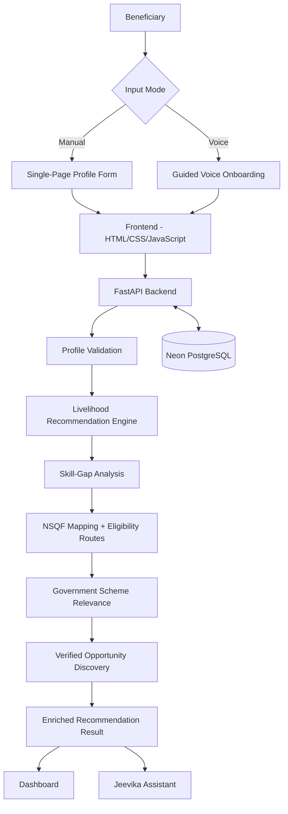

# Jeevika AI

> **AI-Driven Voice Assistant for Livelihood Mapping and NSQF-Aligned Skilling Recommendations for SC Communities under the GIA component of PM-AJAY**

**Smart India Hackathon 2026 — SIH26097**  
**Team:** Innovatrix  
**Ministry:** Ministry of Social Justice and Empowerment (MoSJE)  
**Theme:** Agriculture, FoodTech & Rural Development  
**Category:** Software  
**Status:** Functional Cloud-Deployed MVP

---

## Live Project

- **Frontend:** https://jeevika-ai-sooty.vercel.app
- **Backend API:** https://jeevika-ai-api.onrender.com
- **API Docs:** https://jeevika-ai-api.onrender.com/docs
- **GitHub:** https://github.com/Adarsha-o-O/jeevika-ai

> The Render free-tier backend may require a short cold start after inactivity.

---

## Overview

Jeevika AI is an **explainable multilingual livelihood decision-support platform** that converts a beneficiary profile into a practical livelihood pathway.

```text
Beneficiary Profile
        ↓
Livelihood Recommendation
        ↓
Matched Skills
        ↓
Skill-Gap Analysis
        ↓
NSQF Qualification Mapping
        ↓
Eligibility / Verification Guidance
        ↓
Government Scheme Relevance
        ↓
Verified Opportunity Sources
        ↓
Multilingual Assistant Guidance
```

Jeevika is not intended to replace official government portals. It acts as a **decision-support and navigation layer** across fragmented livelihood, skilling, qualification, scheme and opportunity ecosystems.

---

## Problem

Beneficiaries may have useful skills, informal work experience and interests but still struggle to answer:

- Which livelihoods fit my profile?
- Why is a livelihood suitable for me?
- Which skills am I missing?
- Which NSQF pathway is relevant?
- Which government schemes should I explore?
- Where can I find verified training, apprenticeship or employment opportunities?

The core challenge is **fragmentation** across multiple systems.

Jeevika brings these steps into one explainable workflow.

---

## Key Features

### Manual Onboarding

A single-page beneficiary form captures:

- Name
- Age
- Gender
- State
- District
- Village
- Education level
- Current occupation
- Existing skills
- Interests
- Experience
- Income target
- Willingness to relocate

### Guided Voice Onboarding

Browser-based voice onboarding uses the **Web Speech API**.

```text
Speak Question
     ↓
Recognise Answer
     ↓
Preview
     ↓
Confirm / Retry / Skip
     ↓
Next Question
```

The guided flow covers approximately 13 profile questions.

### Multilingual Support

Current languages:

- English
- Kannada
- Hindi

Language selection affects UI labels, onboarding prompts, assistant responses, speech recognition and speech synthesis.

### Explainable Livelihood Recommendation

The current engine is **rules/data-driven and explainable**, not a trained black-box ML model.

| Component | Weight |
|---|---:|
| Education compatibility | 15 |
| Required skill coverage | 35 |
| Interest alignment | 15 |
| Current occupation relevance | 25 |
| Related experience | 10 |
| **Total** | **100** |

The score represents **profile fit**, not probability of livelihood success.

Each recommendation can include:

- Occupation and sector
- Match score
- Matched skills
- Matched interests
- Recommendation reasons
- Required skills
- Skill gaps
- NSQF pathways
- Government schemes
- Verified opportunity sources

### Skill-Gap Analysis

Jeevika compares required occupation skills against beneficiary skills.

```text
Required Skills
- diagnostics
- mechanical work
- tools

Existing Skills
- mechanical work

Skill Gap
- diagnostics
- tools
```

---

## NSQF Intelligence

The NSQF layer can provide:

- Qualification name
- NSQF level
- Qualification code
- Duration
- Exact / related pathway
- Eligibility routes
- Education requirement
- Experience requirement
- Eligibility status
- Validity status
- Official source

### Mapping Types

- Exact Pathway
- Related Pathway

### Eligibility States

- Eligible
- Not Currently Eligible
- Needs Verification

When the current beneficiary profile cannot establish an official condition, Jeevika uses **Needs Verification** rather than fabricating certainty.

### Validity States

- Current
- Expired
- Not Active Yet
- Validity Unconfirmed

Expired records are not presented as current active guidance.

---

## Government Scheme Intelligence

The scheme layer ranks schemes by **relevance**, rather than attaching the same schemes to every occupation.

Current curated scheme records include:

- PMKVY
- NAPS
- PMEGP
- DDU-GKY
- PM SVANidhi
- PMMY / MUDRA

Relevance labels:

- Highly Relevant
- Relevant
- Worth Checking

Each scheme result can show:

- Why Jeevika suggested it
- Potential benefit
- What still needs verification
- Application mode
- Official source
- Information verification date

> **Scheme relevance is not official eligibility.** Final eligibility must be verified with the respective authority.

---

## Verified Opportunity Intelligence

Jeevika uses verified official discovery sources rather than fabricated local openings.

Current verified source records include:

- Karnataka SkillConnect
- National Career Service
- Apprenticeship India
- Skill India Digital Hub

The system distinguishes:

- District Source
- State Source
- National Source

Opportunity relevance can consider location, occupation, sector, apprenticeship suitability, skill gaps and NSQF pathways.

> A verified opportunity source does not guarantee that a live vacancy currently exists.

---

## Jeevika Assistant

The dashboard includes an intent-aware assistant supporting text and voice.

It understands requests related to:

- Recommendation
- Why a livelihood was recommended
- Skills to learn
- NSQF pathways
- Eligibility
- Government schemes
- Alternatives
- Opportunities
- Profile information

Example questions:

```text
Why is this livelihood suitable for me?
What skills should I learn?
Which NSQF course is suitable for me?
Am I eligible?
Which schemes are relevant?
Where can I apply?
Show me other options.
```

---

## Current MVP Metrics

| Metric | Current Status |
|---|---:|
| Livelihood roles | **124** |
| Supported languages | **3** |
| Curated regression profiles passed | **10 / 10** |
| Curated government scheme records | **6** |
| Verified opportunity-source records | **4** |
| Frontend | **Live** |
| Backend | **Live** |
| Database persistence | **PostgreSQL** |

> **10/10 curated regression profiles passed** is a regression-test result, not a claim of 100% real-world recommendation accuracy.

---

## Technical Architecture



---

## Recommendation Pipeline

```text
1. Receive beneficiary profile
2. Validate profile
3. Store / retrieve beneficiary
4. Rank livelihood occupations
5. Generate recommendation explanation
6. Identify matched skills and skill gaps
7. Map NSQF qualification pathways
8. Evaluate NSQF eligibility routes
9. Attach relevant government schemes
10. Attach verified opportunity sources
11. Return enriched recommendation payload
12. Display recommendation on dashboard
13. Answer follow-up questions through Jeevika Assistant
```

---

## Technology Stack

### Frontend

- HTML
- CSS
- JavaScript
- Web Speech API
- Vercel

### Backend

- Python
- FastAPI
- Render

### Database

- PostgreSQL
- Neon PostgreSQL

### Version Control

- Git
- GitHub

---

## API Overview

```http
POST /beneficiaries/
GET  /beneficiaries/{beneficiary_id}

POST /recommendations/{beneficiary_id}
GET  /recommendations/saved/{beneficiary_id}

POST /assistant/query/{beneficiary_id}

GET  /health
GET  /
```

Representative beneficiary creation response:

```json
{
  "message": "Beneficiary created successfully",
  "beneficiary_id": 1
}
```

The beneficiary ID is used internally and is not intended to be a primary user-facing element.

---

## Beneficiary Profile Schema

```json
{
  "name": "Ravi Kumar",
  "age": 20,
  "gender": "Male",
  "state": "Karnataka",
  "district": "Shivamogga",
  "village": "Vijayanagara",
  "education_level": "10th",
  "current_occupation": "Mechanic Helper",
  "existing_skills": [
    "mechanical work",
    "electrical work"
  ],
  "interests": [
    "automobiles"
  ],
  "preferred_language": "Kannada",
  "experience_years": 0.5,
  "income_target": 0,
  "willing_to_relocate": false
}
```

---

## Project Structure

```text
jeevika-ai/
│
├── backend/
│   └── app/
│       ├── main.py
│       ├── ml/
│       │   ├── livelihood_mapper.py
│       │   ├── eligibility_engine.py
│       │   ├── nsqf_mapper.py
│       │   ├── scheme_mapper.py
│       │   └── opportunity_mapper.py
│       └── schemas/
│           └── recommendation.py
│
├── frontend/
│   ├── index.html
│   ├── i18n.js
│   └── assets/
│       └── jeevika-logo.png
│
├── data/
│   ├── occupations/
│   │   └── occupations.csv
│   ├── nsqf/
│   │   └── nsqf_qualifications.csv
│   ├── schemes/
│   │   └── government_schemes.csv
│   ├── opportunities/
│   │   └── local_opportunities.csv
│   └── test/
│       ├── test_livelihood_mapper.py
│       ├── test_scoring_v2.py
│       ├── test_nsqf_mapping_v2.py
│       ├── test_scheme_mapper_v2.py
│       ├── test_opportunity_mapper_v2.py
│       └── validate_recommendations.py
│
└── README.md
```

---

## Local Setup

### Clone

```bash
git clone https://github.com/Adarsha-o-O/jeevika-ai.git
cd jeevika-ai
```

### Backend

```bash
cd backend
python -m venv venv
```

Windows:

```bash
venv\Scripts\activate
```

Linux/macOS:

```bash
source venv/bin/activate
```

Install dependencies:

```bash
pip install -r requirements.txt
```

Run:

```bash
uvicorn app.main:app --reload
```

Local API:

```text
http://127.0.0.1:8000
```

Swagger:

```text
http://127.0.0.1:8000/docs
```

### Frontend

In another terminal:

```bash
cd frontend
python -m http.server 5500
```

Open:

```text
http://localhost:5500
```

---

## Testing

Run from the repository root.

### Opportunity Intelligence

```bash
python -u data/test/test_opportunity_mapper_v2.py
```

### Scheme Intelligence

```bash
python -u data/test/test_scheme_mapper_v2.py
```

### NSQF Mapping

```bash
python -u data/test/test_nsqf_mapping_v2.py
```

### Livelihood Mapper

```bash
python -u data/test/test_livelihood_mapper.py
```

### Recommendation Regression Suite

```bash
python -u data/test/validate_recommendations.py
```

Current curated validation result:

```text
PASS: 10 / 10
CHECK: 0
FAIL: 0
```

---

## Validation & Robustness

Current validation includes checks for:

- Age
- Experience
- Income
- Meaningful names and locations
- Occupation
- Skills
- Interests
- List-size limits
- Plausibility between age and experience

Manual and voice onboarding use the same final profile validation before submission.

---

## Security

### Current MVP Controls

- HTTPS through cloud hosting
- Controlled CORS origins
- Frontend validation
- Backend validation
- Safe external links
- Persistent structured database storage
- Internal beneficiary ID hidden from normal UI

### Production Security Roadmap

A government-scale deployment should add:

- Government identity / SSO
- Role-based access control
- Field-worker/admin roles
- Sensitive-field encryption
- Audit logs
- API gateway
- Rate limiting
- Secrets management
- Consent management
- Data-retention policy
- Monitoring and alerting
- Backup / disaster recovery
- Government-approved hosting where required

These are roadmap items, not claims about the current MVP.

---

## Scalability

The application separates frontend, API, database, recommendation logic and reference datasets.

Potential production scaling:

- Stateless API replicas
- Load balancing
- Managed PostgreSQL
- Caching
- Background workers
- Containerization
- Monitoring
- CI/CD
- Dataset synchronization

The current deployment demonstrates cloud feasibility; nationwide concurrency has not yet been load-tested.

---

## Current Limitations

1. **Recommendation engine** — Explainable rules/data-driven system; not a trained black-box ML model.
2. **Occupation coverage** — 124 roles; not exhaustive.
3. **NSQF coverage** — Useful but not complete for every occupation.
4. **Scheme coverage** — Curated verified set; not every government scheme.
5. **Official eligibility** — Relevance/pre-screening guidance does not guarantee final eligibility.
6. **Opportunities** — Primarily verified discovery portals rather than claims of live vacancies.
7. **Voice** — Browser speech support varies.
8. **Security** — More hardening is required for government production deployment.
9. **Field validation** — Large-scale beneficiary pilots have not yet been completed.

---

## Roadmap

### Next Milestone — Personalized Livelihood Action Plan

```text
Recommended Livelihood
       ↓
Skills to Strengthen
       ↓
NSQF / Training Pathway
       ↓
Eligibility Actions
       ↓
Government Support
       ↓
Verified Opportunity Sources
       ↓
Immediate Next Step
```

### Future Work

- Wider NSQF coverage
- More verified scheme records
- More state-specific opportunity sources
- Additional Indian languages
- Beneficiary field pilot
- Counsellor dashboard
- Assisted field-worker mode
- Government SSO
- Role-based access control
- Audit and monitoring
- Government-system integration
- Dataset synchronization
- Programme analytics

---

## SIH Demo Flow

```text
1. Choose language
2. Create beneficiary profile
3. Generate recommendations
4. Expand the top recommendation
5. Explain why it was recommended
6. Show matched skills and skill gaps
7. Show NSQF pathway
8. Show government scheme relevance
9. Show verified opportunity sources
10. Ask Jeevika Assistant: "Where can I apply?"
```

---

## Design Principles

### Explainability

Recommendations should show understandable reasons.

### Verification

When information is insufficient, Jeevika should say **Needs Verification** rather than invent certainty.

### Source Transparency

Official qualification, scheme and opportunity sources are surfaced where possible.

### Human Agency

Jeevika supports beneficiary and counsellor decisions; it does not make career decisions on behalf of users.

---

## Claim Discipline

### Correct

> 10/10 curated regression profiles passed.

### Incorrect

> 100% model accuracy.

---

### Correct

> This scheme is highly relevant to the current pathway.

### Incorrect

> The beneficiary is officially approved for the scheme.

---

### Correct

> Verified opportunity source.

### Incorrect

> A live vacancy definitely exists.

---

### Correct

> Functional cloud-deployed MVP.

### Incorrect

> Production-ready nationwide government platform.

---

## Official Ecosystems Referenced

Jeevika references official ecosystems such as:

- PM-AJAY
- Ministry of Social Justice and Empowerment
- NCVET / National Qualification Register
- Skill India Digital
- National Career Service
- Apprenticeship India
- Karnataka SkillConnect

Jeevika acts as an explainable navigation and decision-support layer over these ecosystems.

---

## Team Innovatrix

- U. Adarsha
- D.S. Ullas
- Rishi N
- Ganesh H.R
- Shreya B Gowda
- Pratheeksha R

---

## Links

- **Live App:** https://jeevika-ai-sooty.vercel.app
- **Backend:** https://jeevika-ai-api.onrender.com
- **API Docs:** https://jeevika-ai-api.onrender.com/docs
- **GitHub:** https://github.com/Adarsha-o-O/jeevika-ai

---

## Final Note

Jeevika AI is currently a **functional cloud-deployed MVP**.

Its key strength is the integration of:

**Profile → Livelihood → Skills → NSQF → Schemes → Verified Opportunities**

into one multilingual, explainable and actionable beneficiary journey.
