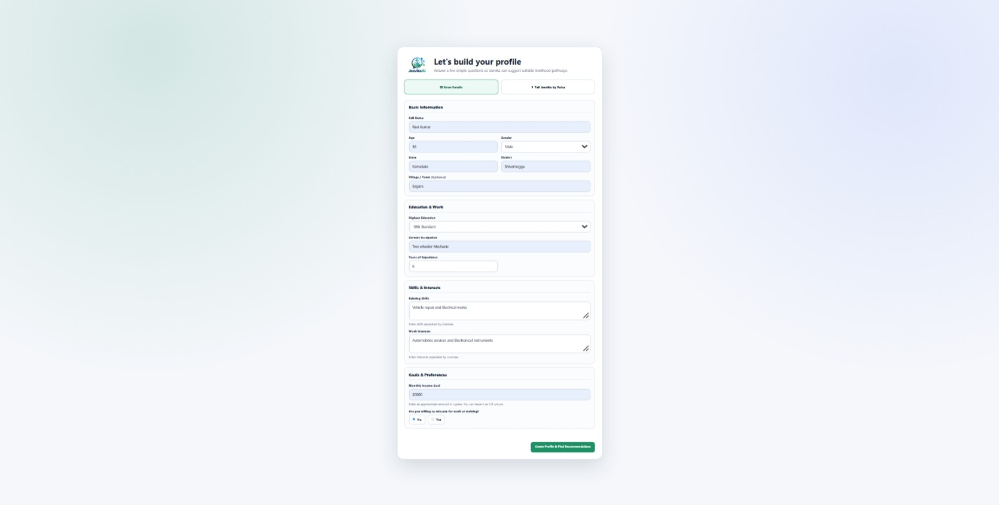
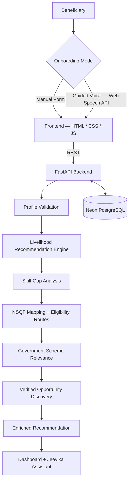

<p align="center">
  
</p>

<h1 align="center">Jeevika AI</h1>

<p align="center">
  <b>Explainable multilingual livelihood intelligence for beneficiary-to-action pathway discovery.</b>
</p>

<p align="center">
  
  
  
  
  
  
  
  
</p>

---

## Live Links

| Resource | URL |
|---|---|
| Live Demo (Frontend) | https://jeevika-ai-sooty.vercel.app |
| Backend API | https://jeevika-ai-api.onrender.com |
| API Docs (Swagger) | https://jeevika-ai-api.onrender.com/docs |
| GitHub | https://github.com/Adarsha-o-O/jeevika-ai |

> The backend runs on a free Render instance and may need a short cold start after inactivity.

---

## Smart India Hackathon 2026

| Field | Detail |
|---|---|
| Problem Statement ID | **SIH26097** |
| Problem Statement | AI-Driven Voice Assistant for Livelihood Mapping and NSQF-Aligned Skilling Recommendations for SC Communities under the GIA component of PM-AJAY |
| Ministry | Ministry of Social Justice and Empowerment (MoSJE) |
| Theme | Agriculture, FoodTech & Rural Development |
| Category | Software |
| Team | **Innovatrix** |
| Current Status | **Functional cloud-deployed MVP** (not a production-hardened government deployment) |

---

## Project Overview

Jeevika AI is an **explainable multilingual livelihood decision-support platform**. It converts a beneficiary profile into a structured livelihood-to-action pathway instead of returning an opaque list of jobs.

```text
Beneficiary Profile
   → Livelihood Recommendation
   → Matched Skills
   → Skill-Gap Analysis
   → NSQF Qualification Mapping
   → Eligibility / Verification Guidance
   → Government Scheme Relevance
   → Verified Opportunity Sources
   → Multilingual Assistant Guidance
```

Jeevika is **not another job portal**. It is a decision-support and navigation layer over fragmented skilling, qualification, scheme and opportunity ecosystems.

> Jeevika does not replace Skill India, NCS, Apprenticeship India, PM-AJAY or other official portals. It helps beneficiaries understand which pathway and official ecosystem may be relevant to them.

<p align="center">
  
</p>

---

## Problem

A beneficiary may have real skills, informal work experience and clear interests, and still be unable to answer:

- Which livelihoods actually fit my profile, and **why**?
- Which skills am I missing for that livelihood?
- Which NSQF qualification maps to it, and am I eligible for it?
- Which government scheme is relevant to my situation?
- Where do I go next — which **official** portal do I actually use?

This information exists, but it is spread across separate portals, in multiple formats, mostly in English, and rarely connected to an individual profile.

---

## How Jeevika Solves It

```text
Profile → Livelihood → Skill Gap → NSQF → Schemes → Verified Opportunities
```

Every stage is explainable: the beneficiary is told **why** a livelihood was suggested, **what** is missing, **which** qualification pathway applies, **what still needs verification**, and **where** the official source is.

---

## Current Feature Highlights

| # | Feature | What it does today |
|---|---|---|
| 1 | Manual onboarding | Single-page profile form — name, age, gender, state, district, village, education, occupation, experience, skills, interests, income target, relocation willingness |
| 2 | Guided voice onboarding | ~13 spoken questions using the browser Web Speech API — speak → recognise → preview → confirm / retry / skip → continue |
| 3 | Multilingual support | English, Kannada and Hindi across UI, onboarding prompts, assistant responses, speech recognition and speech synthesis |
| 4 | Explainable recommendations | Ranked livelihoods from a 124-role occupation catalogue with a transparent, weighted profile-fit score |
| 5 | Skill-gap analysis | Required occupation skills vs existing beneficiary skills → skills to strengthen |
| 6 | NSQF intelligence | Qualification name, level, code, duration, pathway type, eligibility routes, eligibility state, validity state, official source |
| 7 | Government scheme intelligence | Relevance labels, reasoning, possible benefit, what needs verification, application mode, official source |
| 8 | Verified opportunity intelligence | District / State / National official discovery channels with reasoning and official links |
| 9 | Jeevika Assistant | Text + voice Q&A over the beneficiary's own recommendation context |

---

## Current MVP Metrics

| Metric | Value |
|---|---|
| Livelihood roles in catalogue | **124** |
| NSQF qualification records | **47** |
| Curated government scheme records | **6** |
| Verified opportunity-source records | **4** |
| Supported languages | **3** (English, Kannada, Hindi) |
| Curated recommendation regression profiles | **10/10 passed** |
| Frontend | Deployed (Vercel) |
| Backend | Deployed (Render) |
| Persistence | PostgreSQL (Neon) implemented |

> These are dataset and validation counts for the current MVP, not population-level performance measurements.

---

## Explainable Recommendation Engine

The engine is **rules/data-driven**, not a trained black-box model. Each recommendation carries the reasoning that produced it.

| Scoring component | Weight |
|---|---|
| Education compatibility | 15 |
| Required skill coverage | 35 |
| Interest alignment | 15 |
| Current occupation relevance | 25 |
| Related experience | 10 |
| **Total** | **100** |

> **The score represents profile fit, not probability of livelihood success.** A 55% match means the profile currently satisfies 55 of 100 fit points — it is not a prediction of income, placement or outcome.

Because the weights are fixed and inspectable, any recommendation can be audited by a counsellor, reviewer or developer.

---

## Skill-Gap Intelligence

For each recommended livelihood, Jeevika compares:

```text
required occupation skills  ⟷  beneficiary existing skills
```

and returns:

- **Matched skills** — what the beneficiary already brings
- **Skills to develop** — the gap that training should close

This gap is also what makes downstream NSQF and scheme reasoning concrete rather than generic.

---

## NSQF Intelligence

For a mapped qualification, Jeevika can display:

- Qualification name, **NSQF level**, qualification code, duration
- Mapping type — exact pathway or related pathway
- Eligibility routes, education requirements, experience requirements
- Official source link

**Eligibility states:** `Eligible` · `Not Currently Eligible` · `Needs Verification`

**Validity states:** `Current` · `Expired` · `Not Active Yet` · `Validity Unconfirmed`

> Expired qualifications are never represented as current. Where validity could not be confirmed from the source record, the UI states `Validity unconfirmed` rather than assuming.

---

## Government Scheme Intelligence

Curated scheme records currently include **PMKVY**, **NAPS**, **PMEGP**, **DDU-GKY**, **PM SVANidhi** and **PMMY / MUDRA**.

**Relevance labels:** `Highly Relevant` · `Relevant` · `Worth Checking`

For each scheme Jeevika explains:

- why it was matched to this profile and livelihood
- the possible benefit
- what must still be verified before applying
- application mode and the official source

> **Scheme relevance is pre-screening, not official eligibility.** Only the administering authority can confirm eligibility.

---

## Verified Opportunity Intelligence

Verified opportunity-source records currently include **Karnataka SkillConnect**, **National Career Service**, **Apprenticeship India** and **Skill India Digital Hub**, classified as `District`, `State` or `National` sources.

Each source is shown with why it is useful for this specific beneficiary, its access mode and its official link.

> **A verified opportunity source is an official discovery channel, not a guaranteed live vacancy.** Listings and availability change on the official portal.

---

## Jeevika Assistant

A text + voice assistant scoped to the beneficiary's own profile and recommendations.

Supported intent areas: recommendations · why this livelihood · skills · NSQF · eligibility · schemes · alternatives · opportunities · beneficiary profile.

Example questions:

```text
"Why is this livelihood suitable for me?"
"What skills should I learn?"
"Which NSQF course is suitable?"
"Which schemes are relevant?"
"Where can I apply?"
```

---

## Multilingual + Voice Experience

<p align="center">
  
</p>

- Language selection affects UI, onboarding prompts, assistant replies, speech recognition locale and speech synthesis.
- Voice onboarding is designed for **assisted digital access** — every answer is previewed and confirmed before it is stored.
- Manual and voice onboarding share the **same final profile validation**, so both paths produce equally trustworthy profiles.

> Browser voice capability varies by browser and device; the manual form is always available as a fallback.

---

## Technical Architecture



---

## Technology Stack

| Layer | Technology | Purpose |
|---|---|---|
| Frontend | HTML, CSS, JavaScript | Onboarding, recommendation dashboard, assistant UI |
| Voice | Web Speech API | Speech recognition and speech synthesis in the browser |
| Localisation | `frontend/i18n.js` | English / Kannada / Hindi strings and speech locales |
| Frontend hosting | Vercel | Static deployment of the frontend |
| Backend | Python, FastAPI | REST API, validation, recommendation orchestration |
| Intelligence layer | Python modules under `backend/app/ml/` | Scoring, livelihood mapping, NSQF, schemes, opportunities |
| ORM | SQLAlchemy | Models and database session management |
| Database | Neon PostgreSQL (SQLite fallback for local dev) | Beneficiary and recommendation persistence |
| Backend hosting | Render | API deployment |
| Knowledge base | CSV datasets under `data/` | Occupations, NSQF qualifications, schemes, opportunity sources |
| Version control | Git + GitHub | Source control and collaboration |

---

## API Overview

Base URL: `https://jeevika-ai-api.onrender.com`

| Method | Endpoint | Purpose |
|---|---|---|
| `GET` | `/` | Service banner |
| `GET` | `/health` | Health check |
| `POST` | `/beneficiaries/` | Create a beneficiary profile → returns `beneficiary_id` |
| `GET` | `/beneficiaries/{beneficiary_id}` | Fetch a stored beneficiary profile |
| `POST` | `/recommendations/{beneficiary_id}` | Generate and persist enriched recommendations |
| `GET` | `/recommendations/saved/{beneficiary_id}` | Fetch previously saved recommendations |
| `POST` | `/assistant/query/{beneficiary_id}` | Ask the Jeevika Assistant in the selected language |

Interactive documentation is available at [`/docs`](https://jeevika-ai-api.onrender.com/docs).

<details>
<summary><b>Assistant request example</b></summary>

```http
POST /assistant/query/1
Content-Type: application/json

{
  "query": "Why is this livelihood suitable for me?",
  "language": "Kannada"
}
```

</details>

---

## Beneficiary Profile Example

```json
{
  "name": "Ravi Kumar",
  "age": 36,
  "gender": "Male",
  "state": "Karnataka",
  "district": "Shivamogga",
  "village": "Sagara",
  "education_level": "10th",
  "current_occupation": "Two Wheeler Mechanic",
  "existing_skills": ["Vehicle repair", "Electrical works"],
  "interests": ["Automobile services", "Electronic instruments"],
  "preferred_language": "English",
  "experience_years": 6,
  "income_target": 20000,
  "willing_to_relocate": false
}
```

Validation covers age, experience, income, meaningful name/location values, occupation, skills, interests, list-size constraints, and experience plausibility relative to age.

---

## Repository Structure

```text
jeevika-ai/
├── backend/
│   ├── app/
│   │   ├── api/
│   │   │   ├── assistant.py
│   │   │   ├── beneficiaries.py
│   │   │   └── recommendations.py
│   │   ├── database/
│   │   │   └── database.py
│   │   ├── ml/
│   │   │   ├── eligibility_engine.py
│   │   │   ├── livelihood_mapper.py
│   │   │   ├── nsqf_mapper.py
│   │   │   ├── opportunity_mapper.py
│   │   │   ├── scheme_mapper.py
│   │   │   ├── scoring_engine.py
│   │   │   ├── skill_recommender.py
│   │   │   └── text_matcher.py
│   │   ├── models/
│   │   │   ├── beneficiary.py
│   │   │   └── recommendation.py
│   │   ├── schemas/
│   │   │   ├── beneficiary.py
│   │   │   └── recommendation.py
│   │   └── main.py
│   └── requirements.txt
├── data/
│   ├── nsqf/nsqf_qualifications.csv
│   ├── occupations/occupations.csv
│   ├── opportunities/local_opportunities.csv
│   ├── schemes/government_schemes.csv
│   └── test/
│       ├── test_livelihood_mapper.py
│       ├── test_nsqf_mapping_v2.py
│       ├── test_opportunity_mapper_v2.py
│       ├── test_scheme_mapper_v2.py
│       ├── test_scoring_v2.py
│       └── validate_recommendations.py
├── docs/
│   └── jeevika-dashboard.jpeg
├── frontend/
│   ├── assets/jeevika-logo.png
│   ├── i18n.js
│   ├── index.html
│   └── voice.html
├── .gitignore
└── README.md
```

---

## Local Installation / Running

**Prerequisites:** Python 3.10+, Git, and a modern Chromium-based browser for voice features.

### 1. Clone

```bash
git clone https://github.com/Adarsha-o-O/jeevika-ai.git
cd jeevika-ai
```

### 2. Backend

```bash
cd backend
python -m venv .venv
source .venv/bin/activate          # Windows: .venv\Scripts\activate
pip install -r requirements.txt
uvicorn app.main:app --reload
```

API: `http://127.0.0.1:8000` · Docs: `http://127.0.0.1:8000/docs`

**Database configuration (optional):**

```bash
export DATABASE_URL="postgresql://<user>:<password>@<neon-host>/<db>?sslmode=require"
```

If `DATABASE_URL` is not set, the backend falls back to a local SQLite file (`jeevika.db`) for development.

### 3. Frontend

```bash
cd frontend
python -m http.server 5500
```

Open `http://127.0.0.1:5500/index.html`.

> Port **5500** is used because `http://localhost:5500` and `http://127.0.0.1:5500` are the allowed local CORS origins in `backend/app/main.py`.
>
> `frontend/index.html` points `API_BASE` at the deployed Render API. To test against a local backend, change `API_BASE` to `http://127.0.0.1:8000` and add that origin to `ALLOWED_ORIGINS`.

---

## Testing

Run from the **repository root**:

```bash
python -u data/test/validate_recommendations.py    # 10 curated recommendation profiles
python -u data/test/test_scoring_v2.py             # scoring engine smoke test
python -u data/test/test_livelihood_mapper.py      # end-to-end livelihood mapping
python -u data/test/test_nsqf_mapping_v2.py        # NSQF mapping regression
python -u data/test/test_scheme_mapper_v2.py       # scheme relevance regression
python -u data/test/test_opportunity_mapper_v2.py  # opportunity discovery regression
```

**Current result: 10/10 curated regression profiles passed.**

This is regression validation against a curated set of representative profiles — it confirms that expected livelihoods surface correctly for known inputs. It is **not** a measure of real-world accuracy across the beneficiary population.

---

## Security

### Current MVP Controls

- HTTPS via cloud deployment (Vercel / Render)
- Controlled CORS origins configured in `backend/app/main.py`
- Frontend input validation
- Backend schema and profile validation (Pydantic + profile rules)
- Only safe, official external links surfaced to beneficiaries
- PostgreSQL persistence
- Internal beneficiary ID kept out of the normal UI

### Production Roadmap (Not Yet Implemented)

- Government SSO
- RBAC with admin / counsellor / field-worker roles
- Sensitive-field encryption
- Audit logs
- API gateway and rate limiting
- Secrets management
- Consent management and data-retention policy
- Monitoring and disaster recovery

> Everything in the roadmap list above is planned work, not a current capability.

---

## Scalability

**Architecturally ready for:** stateless horizontal scaling of the FastAPI service, managed PostgreSQL connection pooling (`pool_pre_ping`), CDN-served static frontend, and dataset-driven expansion without code rewrites.

**Not yet demonstrated:** nationwide concurrency has **not** been load-tested, and no throughput or concurrent-user numbers are claimed. Current deployment uses free-tier hosting with cold starts.

---

## Current Limitations

- Rules/data-driven recommendation engine — not a trained black-box ML model
- 124 occupations are not exhaustive
- NSQF coverage is incomplete for some occupations
- Scheme dataset is curated (6 records), not exhaustive
- Scheme relevance does not guarantee official eligibility
- Opportunity engine primarily surfaces verified official discovery channels, not live vacancies
- Browser voice capability varies by browser and device
- Large-scale beneficiary field validation is still pending
- Nationwide concurrency has not been load-tested
- Production government security hardening remains future work

---

## Roadmap

**Next planned milestone — Personalized Livelihood Action Plan**

```text
Recommended Livelihood
   → Skills to Strengthen
   → NSQF / Training Pathway
   → Eligibility Actions
   → Government Support
   → Verified Opportunity Sources
   → Immediate Next Step
```

**Additional planned work:** larger NSQF dataset · more scheme records · more state opportunity integrations · more Indian languages · field pilot · counsellor dashboard · field-worker mode · SSO · RBAC · monitoring · government integrations · dataset synchronization · programme analytics.

> All items in this section are roadmap, not current functionality.

---

## Official Ecosystems / Data References

Jeevika AI points beneficiaries toward the following official ecosystems. It does not replace, mirror or transact with them.

| Ecosystem | Role in context | Link |
|---|---|---|
| PM-AJAY (GIA component) | Programme context for the problem statement | — |
| Ministry of Social Justice and Empowerment | Nodal ministry | — |
| NCVET / NQR | NSQF qualification framework reference | — |
| Skill India Digital Hub | Skill course discovery | https://courses.skillindiadigital.gov.in/courses/ |
| National Career Service (NCS) | National career and job discovery | https://ncs.gov.in/ |
| Apprenticeship India | Apprenticeship discovery (also NAPS) | https://www.apprenticeshipindia.gov.in/ |
| Karnataka SkillConnect (KSDC) | State skills and opportunity platform | https://skillconnect.kaushalkar.com/ |
| PMKVY | Short-term training and certification | https://www.msde.gov.in/ |
| PMEGP | Enterprise generation programme | https://www.pmegp.msme.gov.in/ |
| DDU-GKY | Rural skilling programme | https://kaushal.rural.gov.in/ |
| PM SVANidhi | Street-vendor micro-credit | https://pmsvanidhi.mohua.gov.in/ |
| PMMY / MUDRA | Micro-enterprise credit | https://financialservices.gov.in/pradhan-mantri-mudra-yojana-pmmy |

---

## Team Innovatrix

| Member |
|---|
| U. Adarsha |
| D.S. Ullas |
| Rishi N |
| Ganesh H.R |
| Shreya B Gowda |
| Pratheeksha R |

**Smart India Hackathon 2026 · SIH26097 · Ministry of Social Justice and Empowerment**

---

## Project Links

- **Live Demo:** https://jeevika-ai-sooty.vercel.app
- **Backend API:** https://jeevika-ai-api.onrender.com
- **API Docs:** https://jeevika-ai-api.onrender.com/docs
- **Repository:** https://github.com/Adarsha-o-O/jeevika-ai

<p align="center">
  <i>Jeevika AI converts a beneficiary profile into an explainable livelihood-to-action pathway.</i>
</p>