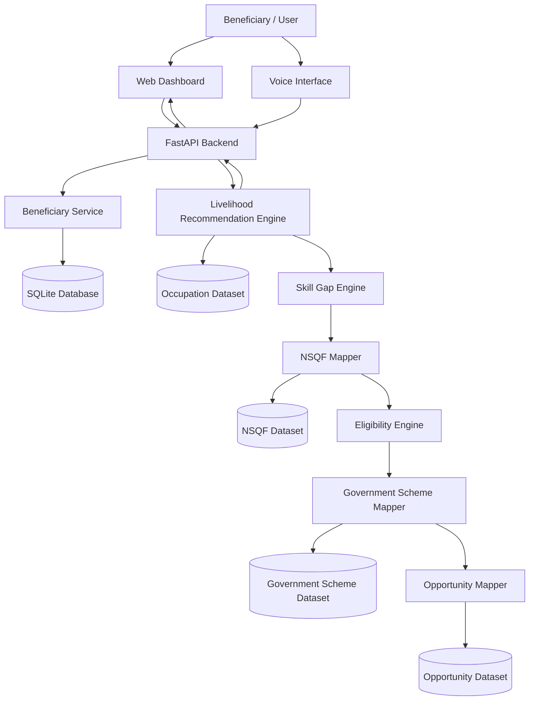

# Jeevika AI

<p align="center">
  <strong>AI-Driven Livelihood Mapping and NSQF-Aligned Skilling Recommendation Platform</strong>
</p>

<p align="center">
  A beneficiary-centric decision-support system designed to map skills, interests, education and work experience to suitable livelihood opportunities, NSQF-aligned qualifications, skill gaps and relevant government schemes.
</p>

---

## Project Overview

**Jeevika AI** is an AI-assisted livelihood recommendation platform developed in response to the Smart India Hackathon problem statement:

> **AI-Driven Voice Assistant for Livelihood Mapping and NSQF-Aligned Skilling Recommendations for SC Communities under the GIA component of PM-AJAY.**

The system is designed to help beneficiaries discover suitable livelihood pathways based on their existing skills, educational background, interests, occupation and experience.

Instead of providing a generic list of jobs, Jeevika AI generates explainable recommendations and supplements them with:

- matched skills
- identified skill gaps
- NSQF-aligned qualifications
- eligibility evaluation
- relevant government schemes
- local opportunity support
- multilingual voice-assisted interaction

The current implementation is a functional prototype intended for demonstration, validation and further expansion.

---

## Problem Statement

Livelihood and skilling recommendations are often fragmented across multiple systems.

A beneficiary may need to independently understand:

- which livelihood is suitable for their profile
- which skills they already possess
- which additional skills are required
- which NSQF qualification is relevant
- whether they meet the qualification eligibility criteria
- which government schemes may support them
- what employment or livelihood opportunities are available locally

This creates information gaps, especially for beneficiaries who may have limited access to structured career guidance.

**Jeevika AI brings these components into a single recommendation workflow.**

---

## Proposed Solution

Jeevika AI accepts a beneficiary profile containing information such as:

- education level
- current occupation
- existing skills
- interests
- work experience
- district and state
- preferred language

The system then processes the profile through an explainable recommendation pipeline.

```text
Beneficiary Profile
        │
        ▼
Profile Normalization
        │
        ▼
Occupation Matching
        │
        ▼
Recommendation Scoring
        │
        ▼
Skill Gap Detection
        │
        ▼
NSQF Qualification Mapping
        │
        ▼
Eligibility Evaluation
        │
        ▼
Government Scheme Mapping
        │
        ▼
Local Opportunity Mapping
        │
        ▼
Explainable Livelihood Recommendations
```

---

# Key Features

## 1. Beneficiary Profile Management

The backend maintains structured beneficiary profiles containing personal livelihood-related attributes such as education, skills, interests, experience and location.

Beneficiaries can be created and retrieved through REST APIs.

---

## 2. Explainable Livelihood Recommendation Engine

Jeevika AI ranks occupations by comparing the beneficiary profile with occupation requirements.

The recommendation engine considers:

- education compatibility
- existing skill matches
- interest matches
- current occupation relevance

Each recommendation includes a match score and a human-readable explanation.

Example:

```text
Data Entry Operator — 67% Match

Matched Skills:
- Computer Basics
- Typing

Skill Gaps:
- Attention to Detail
```

---

## 3. Skill Gap Analysis

For every recommended occupation, Jeevika AI identifies:

```text
Required Skills
      -
Beneficiary's Matched Skills
      =
Skill Gaps
```

This enables the platform to move beyond livelihood discovery and identify what the beneficiary should learn next.

---

## 4. NSQF-Aligned Qualification Mapping

Recommended occupations can be connected with relevant **National Skills Qualifications Framework (NSQF)** qualifications.

Where verified mapping is available, the platform can display:

- qualification name
- NSQF level
- qualification code
- duration
- eligibility routes
- beneficiary eligibility status

Example:

```text
Qualification:
Two Wheeler Service Technician

Qualification Code:
ASC/Q1411

NSQF Level:
4

Duration:
480 Hours
```

---

## 5. Eligibility Engine

The eligibility engine evaluates whether a beneficiary meets the education and experience requirements of an NSQF qualification.

Example:

```text
Education Requirement: 10th
Experience Requirement: 2 Years

Education Eligible: Yes
Experience Eligible: Yes

Overall Eligible: Yes
```

Qualifications with multiple eligibility routes are evaluated route-by-route.

---

## 6. Government Scheme Mapping

The platform maps suitable government programmes and schemes to livelihood recommendations.

The current verified dataset includes programmes such as:

- Pradhan Mantri Kaushal Vikas Yojana (PMKVY)
- National Apprenticeship Promotion Scheme (NAPS)
- Pradhan Mantri Employment Generation Programme (PMEGP)
- Deen Dayal Upadhyaya Grameen Kaushalya Yojana (DDU-GKY)
- Pradhan Mantri Mudra Yojana (PMMY)

Scheme information includes description, benefit, eligibility guidance and official source references where available.

---

## 7. Local Opportunity Mapping

The architecture includes support for mapping local employment and livelihood opportunities to recommendations based on:

- occupation
- sector
- district
- state

> **Note:** Local opportunities are time-sensitive. Opportunity records should be independently verified before being treated as currently active.

---

## 8. Multilingual Voice Assistant

Jeevika AI includes a browser-based voice interaction interface intended to improve accessibility.

The current prototype supports voice interaction workflows for languages including:

- English
- Kannada
- Hindi

The voice interface connects with the Jeevika AI backend and can provide recommendation-related responses.

---

## 9. Integrated Beneficiary Dashboard

The frontend dashboard combines all major system outputs into one interface.

The dashboard displays:

```text
Beneficiary Profile
        +
Livelihood Recommendations
        +
Match Percentage
        +
Matched Skills
        +
Skill Gaps
        +
NSQF Qualifications
        +
Eligibility Information
        +
Government Schemes
        +
Local Opportunities
        +
Voice Assistant
```

---

# Recommendation Methodology

The current system uses an **explainable profile-based ranking engine**.

Rather than producing unexplained recommendations, each result can be traced back to specific matching factors.

### Current Scoring Components

| Component | Contribution |
|---|---:|
| Education compatibility | 20% |
| Skill matching | Up to 40% |
| Interest matching | Up to 30% |
| Current occupation relevance | Up to 10% |
| **Maximum** | **100%** |

Text normalization, aliases and similarity matching are used to improve matching between related user-entered skills and occupation requirements.

Examples include:

```text
car repair → mechanical work
farm work → farming
computer knowledge → computer basics
customer handling → customer service
```

---

# Dataset

## Occupation Dataset

The current curated occupation dataset contains:

```text
124 Occupations
24 Sectors
```

Occupation records may include:

- occupation name
- sector
- minimum education
- required skills
- relevant interests
- description
- employment type
- source reference

---

## NSQF Dataset

Jeevika AI currently uses a **verified subset of NSQF qualification mappings** that are compatible with the current eligibility engine.

Verified mappings currently include selected occupations such as:

```text
Two-Wheeler Mechanic
Four-Wheeler Mechanic
Tailor
Retail Sales Associate
Data Entry Operator
Office Assistant
```

NSQF coverage is intentionally limited to records that have been reviewed before integration rather than assigning unverified qualification data to every occupation.

---

## Government Scheme Dataset

Government scheme records are maintained separately from occupation and NSQF datasets.

The dataset includes official reference URLs wherever available so programme details can be reviewed and updated as policies change.

---

# System Architecture



---

# Technology Stack

| Layer | Technology |
|---|---|
| Backend | Python |
| API Framework | FastAPI |
| Database | SQLite |
| Recommendation Engine | Python |
| Text Matching | Rule-based normalization + similarity matching |
| Data Storage | CSV + SQLite |
| Frontend | HTML, CSS, JavaScript |
| API Communication | REST / JSON |
| Voice Interface | Browser Web Speech capabilities |
| API Documentation | Swagger / OpenAPI |
| Version Control | Git |
| Repository Hosting | GitHub |

---

# Project Structure

```text
jeevika-ai/
│
├── backend/
│   ├── app/
│   │   ├── api/
│   │   │   ├── assistant.py
│   │   │   ├── beneficiaries.py
│   │   │   └── recommendations.py
│   │   │
│   │   ├── database/
│   │   │   └── database.py
│   │   │
│   │   ├── ml/
│   │   │   ├── eligibility_engine.py
│   │   │   ├── livelihood_mapper.py
│   │   │   ├── nsqf_mapper.py
│   │   │   ├── opportunity_mapper.py
│   │   │   ├── scheme_mapper.py
│   │   │   ├── scoring_engine.py
│   │   │   ├── skill_recommender.py
│   │   │   └── text_matcher.py
│   │   │
│   │   ├── models/
│   │   │
│   │   ├── schemas/
│   │   │
│   │   └── main.py
│   │
│   └── requirements.txt
│
├── data/
│   ├── occupations/
│   │   └── occupations.csv
│   │
│   ├── nsqf/
│   │   └── nsqf_qualifications.csv
│   │
│   ├── schemes/
│   │   └── government_schemes.csv
│   │
│   ├── opportunities/
│   │   └── local_opportunities.csv
│   │
│   └── test/
│       ├── test_livelihood_mapper.py
│       └── validate_recommendations.py
│
├── frontend/
│   ├── index.html
│   └── voice.html
│
└── README.md
```

---

# Installation and Setup

## 1. Clone the Repository

```bash
git clone https://github.com/Adarsha-o-O/jeevika-ai.git
cd jeevika-ai
```

---

## 2. Create a Python Virtual Environment

### Windows Git Bash

```bash
cd backend

python -m venv venv

source venv/Scripts/activate
```

### Windows Command Prompt

```cmd
cd backend

python -m venv venv

venv\Scripts\activate
```

---

## 3. Install Dependencies

```bash
pip install -r requirements.txt
```

---

# Running the Backend

From the `backend` directory:

```bash
uvicorn app.main:app --reload
```

The backend will start at:

```text
http://127.0.0.1:8000
```

---

# API Documentation

FastAPI automatically generates interactive Swagger documentation.

Open:

```text
http://127.0.0.1:8000/docs
```

OpenAPI specification:

```text
http://127.0.0.1:8000/openapi.json
```

---

# Major API Endpoints

| Method | Endpoint | Purpose |
|---|---|---|
| `GET` | `/` | Backend root |
| `GET` | `/health` | Health check |
| `POST` | `/beneficiaries/` | Create beneficiary |
| `GET` | `/beneficiaries/{beneficiary_id}` | Retrieve beneficiary |
| `POST` | `/recommendations/{beneficiary_id}` | Generate recommendations |
| `GET` | `/recommendations/saved/{beneficiary_id}` | Retrieve saved recommendations |
| `POST` | `/assistant/query/{beneficiary_id}` | Voice/assistant query endpoint |

---

# Running the Frontend

Keep the backend running.

Open another terminal:

```bash
cd frontend
python -m http.server 5500
```

Then open:

```text
http://localhost:5500
```

The dashboard communicates with the FastAPI backend running on:

```text
http://127.0.0.1:8000
```

---

# Validation

The recommendation engine includes a multi-profile validation suite.

Run:

```bash
python -u data/test/validate_recommendations.py
```

The current validation suite covers ten representative beneficiary profiles:

```text
Agriculture Worker
Tailoring Worker
Two-Wheeler Mechanic
Data Entry Candidate
Retail Sales Worker
Electrician
Welder
Driver
Beauty & Wellness Worker
Low-Education Rural Worker
```

### Current Validation Result

```text
PASS  : 10/10
CHECK : 0/10
FAIL  : 0/10
```

This confirms that the tested profiles produced relevant livelihood recommendations within the expected recommendation categories.

> Validation results represent the current curated test suite and should not be interpreted as universal model accuracy.

---

# Example Recommendation

### Beneficiary

```text
Education:
10th

Skills:
Typing
Computer Basics

Interests:
Computers
Office Work
```

### Jeevika AI Output

```text
1. Data Entry Operator
   Match Score: 67%

   Matched Skills:
   - Computer Basics
   - Typing

   Skill Gap:
   - Attention to Detail

   NSQF Qualification:
   Domestic Data Entry Operator


2. Office Assistant
   Match Score: 60%

   Matched Skills:
   - Computer Basics
   - Typing

   Skill Gaps:
   - Communication
   - Office Work
```

---

# Explainability

Explainability is a central design goal of Jeevika AI.

The system does not only return an occupation name.

It also provides:

```text
Why was this occupation recommended?

Which skills already match?

Which skills are missing?

What NSQF qualification is available?

Is the beneficiary currently eligible?

Which government schemes may be relevant?
```

This makes recommendations easier for beneficiaries, counsellors and programme administrators to understand.

---

# Current Project Status

### Functional Prototype

| Component | Status |
|---|---|
| Beneficiary APIs | ✅ Complete |
| Recommendation Engine | ✅ Complete |
| Occupation Dataset | ✅ Integrated |
| Skill Gap Detection | ✅ Complete |
| NSQF Mapping | ✅ Integrated |
| Eligibility Engine | ✅ Complete |
| Government Scheme Mapping | ✅ Integrated |
| Local Opportunity Architecture | ✅ Implemented |
| Dashboard | ✅ Complete |
| Voice Interface | ✅ Functional Prototype |
| Recommendation Validation | ✅ 10/10 Test Profiles |
| API Integration | ✅ Tested |
| Main Branch Integration | ✅ Complete |

---

# Current Limitations

Jeevika AI is currently a functional prototype and has several areas for future enhancement.

1. NSQF mappings currently cover a verified subset of occupations rather than the complete occupation dataset.

2. Government programme rules can change over time and should be periodically revalidated against official sources.

3. Local employment opportunities are highly time-sensitive and should not be treated as active without verification.

4. The current recommendation engine is based on explainable profile scoring and fuzzy matching. Future versions may incorporate trained machine-learning models after sufficient high-quality beneficiary outcome data becomes available.

5. Voice capabilities depend partly on browser speech support.

6. Production deployment would require additional authentication, authorization, monitoring, database migration and security hardening.

---

# Future Scope

Potential future extensions include:

- expanded NSQF qualification coverage
- verified real-time local job integration
- training-centre discovery
- district-level livelihood analytics
- counsellor dashboards
- beneficiary authentication
- role-based administrative access
- longitudinal beneficiary progress tracking
- improved multilingual natural-language understanding
- outcome-based recommendation learning
- mobile application support
- cloud deployment
- secure production database
- advanced analytics and reporting

---

# Design Principles

Jeevika AI is developed around five core principles:

### Beneficiary-Centric

Recommendations should reflect the beneficiary's actual background rather than present generic opportunities.

### Explainable

Every recommendation should provide understandable reasons.

### Skill-Oriented

The system should identify both existing capabilities and missing skills.

### Standards-Aligned

Where verified data is available, recommendations should connect with NSQF-aligned qualifications.

### Actionable

Livelihood recommendations should be connected with training, schemes and opportunity information whenever possible.

---

# Responsible Use

Jeevika AI is a decision-support prototype.

Recommendations should be used as guidance rather than as guaranteed employment, eligibility or financial-assistance decisions.

Final eligibility for qualifications, government schemes, training programmes and employment opportunities should always be confirmed through the respective authorised organisation or official government source.

---

# Repository

GitHub:

```text
https://github.com/Adarsha-o-O/jeevika-ai
```

---

# Acknowledgement

Jeevika AI was developed as a collaborative student innovation project inspired by the Smart India Hackathon problem statement addressing livelihood mapping and NSQF-aligned skilling recommendations under the PM-AJAY ecosystem.

The project demonstrates how beneficiary profiling, explainable recommendation systems, skill-gap analysis, skilling frameworks, government programmes and voice-assisted interfaces can be integrated into a unified digital platform.

---

<p align="center">
  <strong>Jeevika AI</strong><br>
  Empowering livelihood decisions through skills, opportunity and explainable technology.
</p>