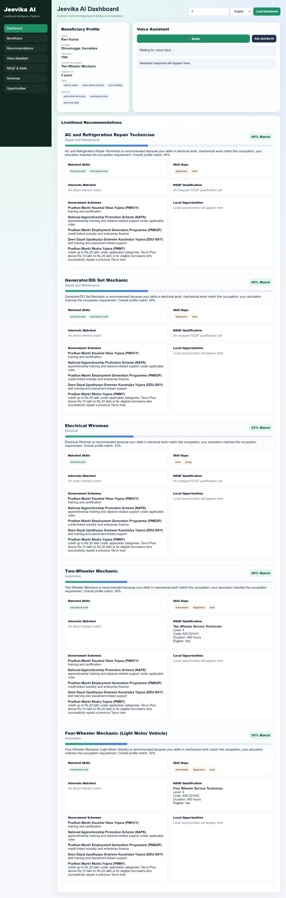
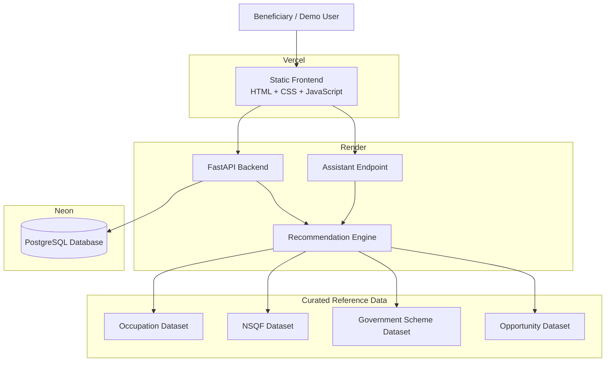

<div align="center">

# Jeevika AI

### AI-Driven Voice Assistant for Livelihood Mapping and NSQF-Aligned Skilling Recommendations

**Smart India Hackathon 2026 · PS ID: SIH26097 · Team Innovatrix**

[](https://jeevika-ai-sooty.vercel.app)
[](https://jeevika-ai-api.onrender.com)
[](https://jeevika-ai-api.onrender.com/docs)
[](https://neon.tech)
[](https://www.python.org)
[](https://fastapi.tiangolo.com)

**Live Demo:** https://jeevika-ai-sooty.vercel.app  
**Backend:** https://jeevika-ai-api.onrender.com  
**Swagger / OpenAPI:** https://jeevika-ai-api.onrender.com/docs  
**Repository:** https://github.com/Adarsha-o-O/jeevika-ai

</div>

---

## Overview

**Jeevika AI** is a deployed functional prototype built for the Smart India Hackathon problem statement:

> **AI-Driven Voice Assistant for Livelihood Mapping and NSQF-Aligned Skilling Recommendations for SC Communities under the GIA component of PM-AJAY.**

The system converts a beneficiary profile into an **explainable livelihood recommendation** and connects that recommendation with:

- matched skills
- skill gaps
- NSQF-aligned qualifications, where verified mapping is available
- qualification eligibility information
- relevant government schemes
- voice-based recommendation interaction

The current implementation is a **working MVP / functional prototype**. It demonstrates the complete recommendation flow from beneficiary profile to livelihood guidance, but it is **not presented as a government-scale production system**.

---

## Live Prototype

<div align="center">
  
  <br/>
  <sub>Current deployed Jeevika AI dashboard using a demo beneficiary profile.</sub>
</div>

---

## Problem

Livelihood guidance is often fragmented.

A beneficiary may need to separately identify:

- suitable livelihood options
- existing strengths
- missing skills
- relevant NSQF qualifications
- qualification eligibility
- supporting government schemes

Jeevika AI brings these components into one explainable workflow.

---

## Solution

Jeevika AI uses a beneficiary's:

- education
- current occupation
- existing skills
- interests
- work experience
- district and state
- preferred language

to rank relevant livelihood options and explain the result.

### Recommendation Flow


---

## What the Prototype Does

### Beneficiary Profile

Stores and retrieves structured beneficiary information including education, skills, interests, occupation, experience and location.

### Explainable Livelihood Recommendations

Ranks occupations against the beneficiary profile and returns:

- occupation name
- sector
- match percentage
- matched skills
- skill gaps
- explanation of the recommendation

### Skill Gap Analysis

For every recommended occupation:

```text
Required Skills
      -
Matched Beneficiary Skills
      =
Skill Gaps
```

This makes the result actionable instead of returning only a job title.

### NSQF Mapping

Where a verified mapping exists, Jeevika AI can display:

- qualification name
- NSQF level
- qualification code
- duration
- eligibility status

Example from the current prototype:

```text
Two Wheeler Service Technician
NSQF Level: 4
Qualification Code: ASC/Q1411
Duration: 480 hours
```

### Government Scheme Mapping

The current curated scheme dataset includes programmes such as:

- Pradhan Mantri Kaushal Vikas Yojana (PMKVY)
- National Apprenticeship Promotion Scheme (NAPS)
- Pradhan Mantri Employment Generation Programme (PMEGP)
- Deen Dayal Upadhyaya Grameen Kaushalya Yojana (DDU-GKY)
- Pradhan Mantri Mudra Yojana (PMMY)

Scheme information should always be rechecked against official sources because programme rules can change.

### Voice Interaction

The browser interface supports voice input/output through browser Web Speech capabilities.

The current prototype is designed for simple recommendation-related queries and supports language selection for:

- English
- Kannada
- Hindi

> This is not described as a full conversational multilingual LLM. Voice capability depends partly on browser speech support.

---

## Recommendation Methodology

The current system uses an **explainable profile-based ranking engine**, not a black-box prediction model.

| Matching Component | Contribution |
|---|---:|
| Education compatibility | 20% |
| Skill matching | Up to 40% |
| Interest matching | Up to 30% |
| Current occupation relevance | Up to 10% |
| **Maximum** | **100%** |

Text normalization, aliases and similarity matching are used to improve matching between related terms.

Examples:

```text
car repair          → mechanical work
farm work           → farming
computer knowledge  → computer basics
customer handling   → customer service
```

---

## Data Coverage

### Occupation Dataset

Current curated coverage:

- **124 occupations**
- **24 sectors**

Occupation records may contain:

- occupation name
- sector
- minimum education
- required skills
- relevant interests
- description
- employment type
- source reference

### NSQF Dataset

The project intentionally uses a **verified subset** of NSQF mappings rather than assigning unverified qualifications to every occupation.

Current mapped examples include:

- Two-Wheeler Mechanic
- Four-Wheeler Mechanic
- Tailor
- Retail Sales Associate
- Data Entry Operator
- Office Assistant

### Government Scheme Dataset

Government schemes are maintained separately so that policy-related information can be reviewed and updated independently.

---

## Production Architecture



### Deployment Summary

| Layer | Current Deployment |
|---|---|
| Frontend | Vercel |
| Backend API | Render |
| Production Database | Neon PostgreSQL |
| Reference datasets | CSV files in repository |
| API documentation | Swagger / OpenAPI |
| Version control | Git + GitHub |
| Production branch | `main` |

---

## Technology Stack

| Area | Technology |
|---|---|
| Backend language | Python |
| API framework | FastAPI |
| ORM / DB layer | SQLAlchemy |
| Production database | Neon PostgreSQL |
| Local database fallback | SQLite |
| Recommendation logic | Explainable profile scoring + fuzzy / alias matching |
| Reference data | CSV |
| Frontend | HTML, CSS, JavaScript |
| Voice | Browser Web Speech API |
| API communication | REST / JSON |
| API documentation | Swagger / OpenAPI |
| Frontend hosting | Vercel |
| Backend hosting | Render |
| Repository hosting | GitHub |

---

## API

Base production URL:

```text
https://jeevika-ai-api.onrender.com
```

Interactive documentation:

```text
https://jeevika-ai-api.onrender.com/docs
```

### Main Endpoints

| Method | Endpoint | Purpose |
|---|---|---|
| `GET` | `/` | Backend root |
| `GET` | `/health` | Service health check |
| `POST` | `/beneficiaries/` | Create a beneficiary |
| `GET` | `/beneficiaries/{beneficiary_id}` | Retrieve beneficiary profile |
| `POST` | `/recommendations/{beneficiary_id}` | Generate livelihood recommendations |
| `GET` | `/recommendations/saved/{beneficiary_id}` | Retrieve saved recommendations |
| `POST` | `/assistant/query/{beneficiary_id}` | Voice / assistant recommendation query |

---

## Project Structure

```text
jeevika-ai/
│
├── backend/
│   ├── app/
│   │   ├── api/
│   │   │   ├── assistant.py
│   │   │   ├── beneficiaries.py
│   │   │   └── recommendations.py
│   │   │
│   │   ├── database/
│   │   │   └── database.py
│   │   │
│   │   ├── ml/
│   │   │   ├── eligibility_engine.py
│   │   │   ├── livelihood_mapper.py
│   │   │   ├── nsqf_mapper.py
│   │   │   ├── opportunity_mapper.py
│   │   │   ├── scheme_mapper.py
│   │   │   ├── scoring_engine.py
│   │   │   ├── skill_recommender.py
│   │   │   └── text_matcher.py
│   │   │
│   │   ├── models/
│   │   ├── schemas/
│   │   └── main.py
│   │
│   └── requirements.txt
│
├── data/
│   ├── occupations/
│   ├── nsqf/
│   ├── schemes/
│   ├── opportunities/
│   └── test/
│
├── frontend/
│   ├── index.html
│   └── voice.html
│
├── docs/
│   └── jeevika-dashboard.png
│
└── README.md
```

---

## Local Development

The deployed system already uses the production Render API and Neon database. These steps are for development/testing.

### 1. Clone

```bash
git clone https://github.com/Adarsha-o-O/jeevika-ai.git
cd jeevika-ai
```

### 2. Backend Environment

```bash
cd backend
python -m venv venv
```

Git Bash:

```bash
source venv/Scripts/activate
```

Windows Command Prompt:

```cmd
venv\Scripts\activate
```

Install dependencies:

```bash
pip install -r requirements.txt
```

### 3. Database

The backend reads the production database connection from:

```text
DATABASE_URL
```

If `DATABASE_URL` is not provided, the current backend configuration falls back to local SQLite for development.

**Never commit database credentials to GitHub.**

### 4. Run Backend Locally

```bash
uvicorn app.main:app --reload
```

Local API:

```text
http://127.0.0.1:8000
```

Local Swagger:

```text
http://127.0.0.1:8000/docs
```

### 5. Run Frontend Locally

```bash
cd frontend
python -m http.server 5500
```

Open:

```text
http://localhost:5500
```

> The current frontend source is configured to call the deployed Render API.  
> If you want a fully local frontend-to-backend workflow, change the frontend API base URL to `http://127.0.0.1:8000` during local development.

---

## Validation

The recommendation pipeline includes a regression-style validation suite covering ten representative beneficiary profiles.

Run:

```bash
python -u data/test/validate_recommendations.py
```

Current test-suite result:

```text
PASS  : 10/10
CHECK : 0/10
FAIL  : 0/10
```

This means the current curated test profiles produced recommendations in the expected categories.

> **Important:** this result is a regression / functional validation result. It is **not** presented as universal model accuracy.

---

## Current Deployment Status

| Component | Status |
|---|---|
| Beneficiary APIs | ✅ Working |
| Recommendation engine | ✅ Working |
| Skill-gap analysis | ✅ Working |
| NSQF mapping | ✅ Working where verified mapping exists |
| Eligibility evaluation | ✅ Working |
| Government scheme mapping | ✅ Working |
| Opportunity-mapping architecture | ✅ Implemented |
| Dashboard | ✅ Deployed |
| Voice interface | ✅ Functional prototype |
| Neon PostgreSQL integration | ✅ Deployed |
| Render backend | ✅ Deployed |
| Vercel frontend | ✅ Deployed |
| Main-branch integration | ✅ Complete |
| Production CORS | ✅ Restricted to deployed frontend |

---

## Current Limitations

The project is intentionally presented as a **functional prototype / MVP**.

Current limitations include:

1. **NSQF coverage is partial.** Only verified mappings are shown.
2. **Local opportunities are time-sensitive.** Records should be verified before being treated as active.
3. **The current beneficiary-ID workflow is demo/admin oriented.** A real beneficiary-facing deployment would require simpler onboarding and identity handling.
4. **Voice interaction is limited to the current recommendation workflow.** It is not a full conversational multilingual NLU system.
5. **Browser support affects speech input/output.**
6. **Authentication and role-based access are not yet implemented.**
7. **Government-scale deployment would require additional monitoring, audit controls, security hardening and field validation.**

---

## Responsible Use

Jeevika AI is a **decision-support prototype**.

Its recommendations should be treated as guidance, not as:

- guaranteed employment
- guaranteed NSQF eligibility
- guaranteed scheme eligibility
- guaranteed financial assistance

Final eligibility and programme information should always be confirmed with the respective authorised organisation or official government source.

---

## Smart India Hackathon 2026

| Field | Details |
|---|---|
| Problem Statement ID | **SIH26097** |
| Category | **Software** |
| Theme | **Agriculture, FoodTech & Rural Development** |
| Problem Statement | **AI-Driven Voice Assistant for Livelihood Mapping and NSQF-Aligned Skilling Recommendations for SC Communities under GIA component of PM-AJAY** |
| Team | **Innovatrix** |

---

<div align="center">

### Jeevika AI

**Profile → Recommendation → Skill Gap → NSQF → Schemes → Voice Guidance**

Built as a deployed functional prototype for Smart India Hackathon 2026.

</div>
